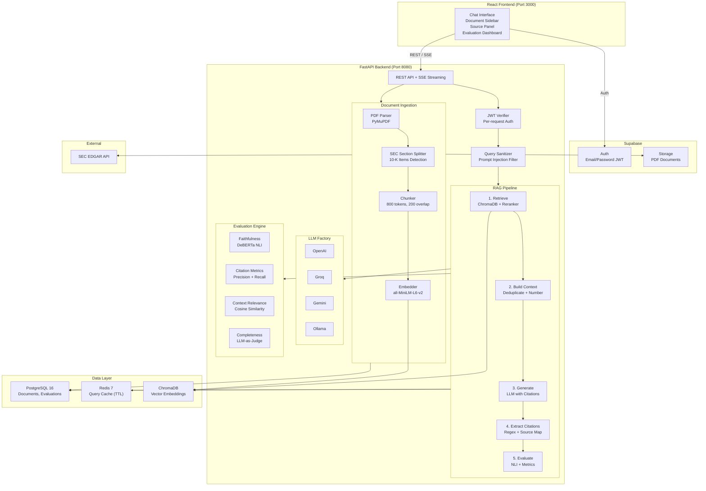

# PolicyRAG

RAG system for SEC financial filing QA with hallucination scoring, citation extraction, LLM provider switching, and multi-user auth.

## Motivation

Financial analysts and compliance teams need trustworthy answers from SEC filings, but LLMs hallucinate. PolicyRAG addresses this by combining retrieval-augmented generation with multi-dimensional evaluation — faithfulness scoring via NLI, citation verification, and context relevance metrics — to provide transparent, auditable QA in regulated environments.

## Architecture



## Features

- **Supabase Auth** — Email/password authentication with JWT, per-user data isolation
- **PDF Storage** — Documents stored in Supabase Storage with user-scoped paths
- **SEC Filing Ingestion** — Upload PDFs or fetch directly from EDGAR by ticker
- **Section-Aware Chunking** — Regex-based SEC section detection (Items 1, 1A, 7, 8, etc.)
- **Cited Answers** — LLM responses with [N] citation markers linked to source chunks
- **Hallucination Scoring** — NLI-based faithfulness evaluation using DeBERTa
- **Citation Metrics** — Precision (NLI entailment check) and recall (coverage)
- **LLM Switching** — Hot-swap between Groq, Gemini, OpenAI, and Ollama per query
- **Cross-Encoder Re-ranking** — ms-marco for improved retrieval precision
- **Redis Caching** — Deterministic cache keys including all retrieval params, TTL-based
- **Evaluation Dashboard** — Historical scores, provider comparison, analytics
- **Compare Mode** — Side-by-side vanilla RAG vs PolicyRAG with shared retrieval
- **Dark/Light Theme** — System preference detection with manual toggle
- **Security Headers** — HSTS, X-Frame-Options, and other security headers on both backend and nginx
- **Per-User Rate Limiting** — JWT-aware rate limiting alongside IP-based limits
- **Prompt Injection Filter** — Pattern-based detection of common injection attempts
- **Structured Logging** — JSON-formatted logs with per-stage latency tracking
- **Automated Benchmarks** — Ground-truth evaluation suite with pass/fail criteria

## Tech Stack

| Layer | Technology |
|-------|-----------|
| Frontend | React 18, TypeScript, Tailwind CSS, Vite |
| Auth | Supabase Auth (email/password, JWT) |
| Storage | Supabase Storage (PDF documents) |
| API | FastAPI, Pydantic v2, SSE, async everywhere |
| Vector DB | ChromaDB (cosine similarity) |
| Embeddings | sentence-transformers/all-MiniLM-L6-v2 |
| Re-ranker | cross-encoder/ms-marco-MiniLM-L-6-v2 |
| NLI Model | cross-encoder/nli-deberta-v3-base |
| LLM | Groq / Gemini / OpenAI / Ollama |
| Database | PostgreSQL 16 (async SQLAlchemy, Supabase-hosted) |
| Cache | Redis 7 |
| Orchestration | Docker Compose |

## Quick Start

### 1. Prerequisites

- Docker and Docker Compose
- A [Supabase](https://supabase.com) project (free tier works)
- At least one LLM API key (GROQ_API_KEY is free)

### 2. Supabase Setup

1. Create a new project at [supabase.com/dashboard](https://supabase.com/dashboard)
2. Go to **Settings → API** and copy:
   - Project URL → `SUPABASE_URL` / `VITE_SUPABASE_URL`
   - `anon` public key → `SUPABASE_ANON_KEY` / `VITE_SUPABASE_ANON_KEY`
   - `service_role` secret key → `SUPABASE_SERVICE_ROLE_KEY`
3. Go to **Settings → Auth → JWT Settings** and copy:
   - JWT Secret → `SUPABASE_JWT_SECRET`
4. Go to **Storage** and create a bucket named `documents` (or your preferred name → `SUPABASE_STORAGE_BUCKET`)

### 3. Configure Environment

```bash
git clone https://github.com/yourusername/policyrag.git
cd policyrag
cp .env.example .env
# Edit .env with your Supabase credentials and LLM API keys
```

### 4. Database Migration

Run the migration to add user isolation columns:

```bash
# Via Supabase SQL Editor (Dashboard → SQL Editor), paste:
# sql/init.sql    (if starting fresh)
# sql/002_add_user_id.sql  (adds user_id + RLS policies)
```

Or via psql:
```bash
psql "$DATABASE_URL" -f sql/init.sql
psql "$DATABASE_URL" -f sql/002_add_user_id.sql
```

### 5. Start Services

```bash
docker-compose up -d
docker-compose ps
curl http://localhost:8080/health
```

### 6. Open the App

```
http://localhost:3000        # UI (sign up / sign in)
http://localhost:8080/docs   # API docs (Swagger)
```

### Development Setup

```bash
# Backend
cd backend
pip install -e ".[dev]"
pytest tests/

# Frontend
cd frontend
npm install
npm run dev
```

### Run Evaluation Benchmark

```bash
# Requires at least one document ingested
cd backend
python -m benchmarks.run_benchmark --api-url http://localhost:8080 --output results.json
```

## Environment Variables

### Backend

| Variable | Required | Description |
|----------|----------|-------------|
| `DATABASE_URL` | Yes | PostgreSQL connection string (Supabase Postgres) |
| `SUPABASE_URL` | Yes | Supabase project URL |
| `SUPABASE_SERVICE_ROLE_KEY` | Yes | Supabase service role key (backend only, never expose to client) |
| `SUPABASE_JWT_SECRET` | Yes | JWT secret for token verification |
| `SUPABASE_ANON_KEY` | No | Supabase anon key (optional for backend) |
| `SUPABASE_STORAGE_BUCKET` | No | Storage bucket name (default: `documents`) |
| `GROQ_API_KEY` | No* | Groq API key |
| `GEMINI_API_KEY` | No* | Google Gemini API key |
| `OPENAI_API_KEY` | No* | OpenAI API key |
| `DEFAULT_LLM_PROVIDER` | No | Default LLM provider (default: `groq`) |
| `DEFAULT_LLM_MODEL` | No | Default model name |
| `REDIS_URL` | No | Redis connection (default: `redis://redis:6379/0`) |
| `CHROMA_HOST` | No | ChromaDB host (default: `chromadb`) |
| `CHROMA_PORT` | No | ChromaDB port (default: `8000`) |
| `EDGAR_USER_AGENT` | No | SEC EDGAR user agent string |
| `CORS_ORIGINS` | No | Allowed CORS origins |

\* At least one LLM API key is required.

### Frontend (Vite build-time)

| Variable | Required | Description |
|----------|----------|-------------|
| `VITE_SUPABASE_URL` | Yes | Supabase project URL |
| `VITE_SUPABASE_ANON_KEY` | Yes | Supabase anon (public) key |

## API Reference

All endpoints except `/health` and `/api/v1/models/*` require a valid JWT in the `Authorization: Bearer <token>` header.

### Query
```
POST /api/v1/query
Authorization: Bearer <jwt>
{
  "query": "What are the key risk factors?",
  "document_ids": [],
  "provider": "groq",
  "model": "llama-3.3-70b-versatile",
  "retrieval_config": {
    "top_k": 10,
    "rerank": true,
    "company_filter": null,
    "section_filter": null,
    "filing_type_filter": null
  },
  "no_cache": false
}
```

### Compare (Vanilla vs PolicyRAG)
```
POST /api/v1/query/compare    # Same request body
Authorization: Bearer <jwt>
```

### Documents
```
POST /api/v1/documents          # Upload PDF (multipart)
POST /api/v1/documents/edgar    # Fetch from EDGAR
GET  /api/v1/documents          # List user's documents
GET  /api/v1/documents/{id}     # Get detail (owner only)
DELETE /api/v1/documents/{id}   # Delete + remove from storage
```

### Models (Public)
```
GET  /api/v1/models             # List available providers
GET  /api/v1/models/active      # Current model
POST /api/v1/models/switch?provider=groq&model=llama-3.3-70b-versatile
```

### Evaluation
```
GET /api/v1/evaluation/history   # Paginated history (user-scoped)
GET /api/v1/evaluation/analytics # Aggregate scores (user-scoped)
GET /api/v1/evaluation/compare   # Provider comparison (user-scoped)
```

## Evaluation Methodology

| Metric | Method | Weight | Range |
|--------|--------|--------|-------|
| Faithfulness | LLM claim decomposition → NLI entailment per-chunk | 40% | 0-1 |
| Hallucination Score | 1 - Faithfulness | — | 0-1 |
| Citation Precision | NLI: cited sentence entailed by source chunk | 20% | 0-1 |
| Citation Recall | % of substantive sentences with citations | 10% | 0-1 |
| Context Relevance | Avg cosine similarity (query ↔ chunks) | 15% | 0-1 |
| Completeness | LLM-as-judge scoring | 15% | 0-1 |
| **Trust Score** | **Weighted composite** | **100%** | **0-1** |

## Security

PolicyRAG implements defense-in-depth across the entire stack:

1. **Input Sanitization** — Regex-based prompt injection detection blocks instruction override and role manipulation attempts before they reach the LLM
2. **Constrained System Prompt** — LLM generation uses a strict system prompt enforcing citation requirements and answer-from-context-only behavior
3. **Faithfulness Evaluation** — DeBERTa NLI model scores every response for factual grounding against source chunks
4. **Abstention** — Responses with trust scores below threshold are flagged with amber badges so users know to verify
5. **JWT Authentication** — Supabase-issued JWTs verified on every protected endpoint using HS256
6. **Row Level Security** — Supabase RLS policies ensure users can only access their own documents at the database level
7. **User-Scoped Retrieval** — ChromaDB queries are filtered by `user_id` metadata, preventing cross-user data leakage in vector search
8. **Supabase Storage Isolation** — PDFs stored under `{user_id}/{doc_id}/` paths
9. **Security Headers** — `X-Content-Type-Options: nosniff`, `X-Frame-Options: DENY`, `Strict-Transport-Security`, `Referrer-Policy`, `Permissions-Policy` on both FastAPI middleware and nginx
10. **Rate Limiting** — IP-based (30 req/min) and per-user JWT-based (20 queries/hour) with `Retry-After` headers
11. **No Secret Exposure** — API keys and service role keys loaded from environment variables only, never sent to the client

## Design Decisions

1. **No full LangChain** — Only `langchain-text-splitters` for chunking. Direct API calls for everything else. Keeps the dependency surface small and the code debuggable.
2. **NLI for faithfulness** — Using DeBERTa NLI model instead of LLM-as-judge for factual grounding. Faster, more consistent, and doesn't consume LLM quota.
3. **Per-chunk entailment** — Claims are checked against each chunk individually (max entailment), not the concatenated context. Prevents long-context dilution.
4. **Unified ChromaDB collection** — Metadata filtering instead of per-document collections. Simpler, supports cross-document queries.
5. **Async everywhere** — SQLAlchemy async, Redis async, httpx for external APIs. ML models run in thread pools via `run_in_executor`.
6. **Models at build time** — Embedding, re-ranker, and NLI models downloaded during Docker build for fast cold starts.
7. **Compare mode fairness** — Both vanilla and PolicyRAG use the same `generate_with_context()` API path, differing only in system prompt content.
8. **Supabase for auth** — Leverages Supabase's managed auth instead of rolling custom auth. JWTs verified locally with shared secret for zero-latency validation.

## Project Structure

```
policyrag/
├── docker-compose.yaml
├── sql/
│   ├── init.sql                 # Base schema
│   └── 002_add_user_id.sql      # User isolation migration + RLS
├── backend/
│   ├── policyrag/
│   │   ├── api/routes/          # FastAPI endpoints
│   │   ├── auth/                # JWT verifier, Supabase storage helper
│   │   ├── core/                # RAG pipeline, retriever, citations, sanitizer
│   │   ├── db/                  # SQLAlchemy models, repositories
│   │   ├── evaluation/          # Faithfulness, citation metrics, relevance
│   │   ├── ingestion/           # PDF parsing, SEC splitting, EDGAR client
│   │   ├── llm/                 # Provider abstraction (Groq/Gemini/OpenAI/Ollama)
│   │   ├── cache/               # Redis query cache
│   │   └── schemas/             # Pydantic models
│   ├── benchmarks/              # Automated evaluation suite
│   └── tests/
└── frontend/
    └── src/
        ├── components/          # React UI components
        ├── contexts/            # Auth, Theme, Toast providers
        ├── hooks/               # Custom React hooks
        ├── lib/                 # Supabase client
        ├── pages/               # LoginPage, ChatPage, LandingPage
        ├── services/            # API client with auth interceptors
        └── types/               # TypeScript interfaces
```

## Future Enhancements

- **Conformal Prediction** — Calibrated confidence intervals for trust scores using conformal prediction sets
- **Streaming Responses** — Token-level SSE streaming with incremental citation highlighting
- **Multi-Turn Conversations** — Context-aware follow-up queries with conversation memory
- **Fine-Tuned Embeddings** — Domain-adapted embedding model trained on SEC filings for improved retrieval
